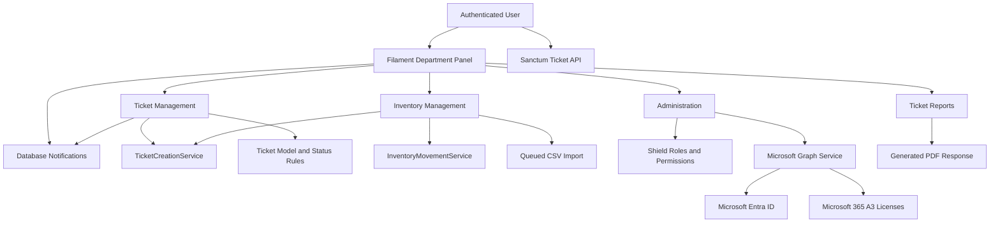
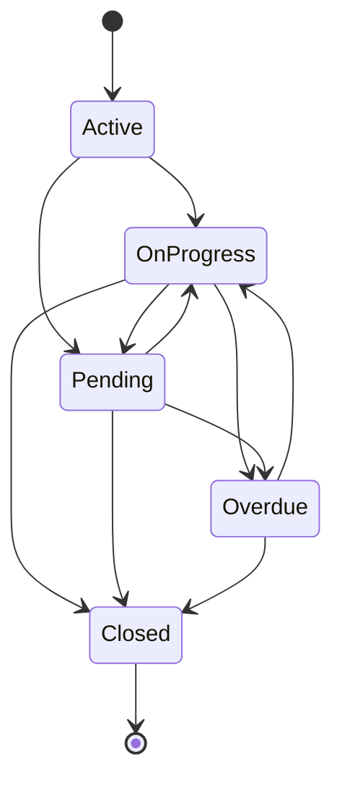
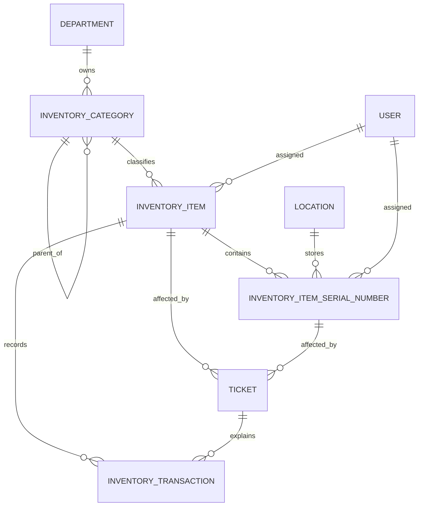
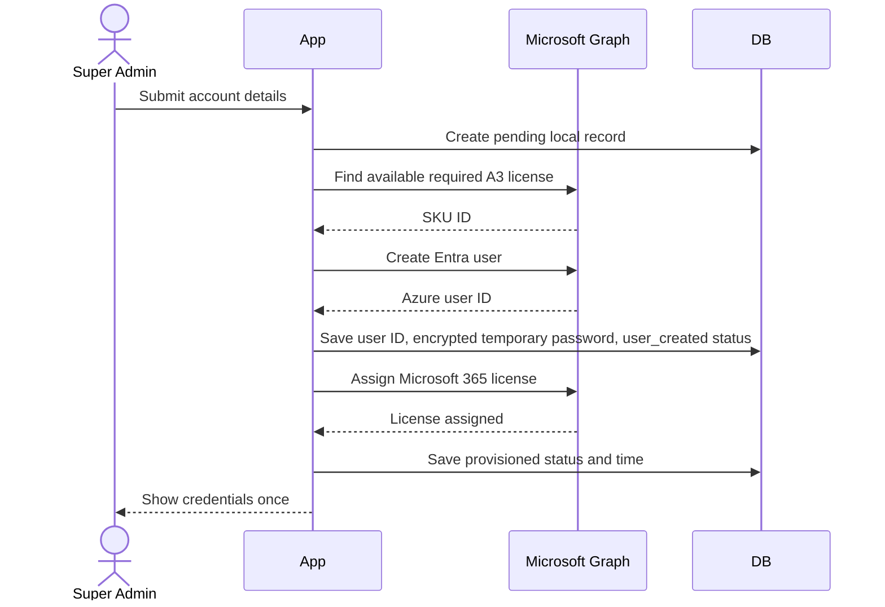
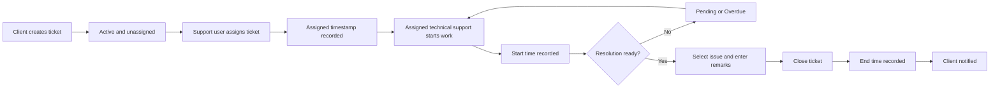
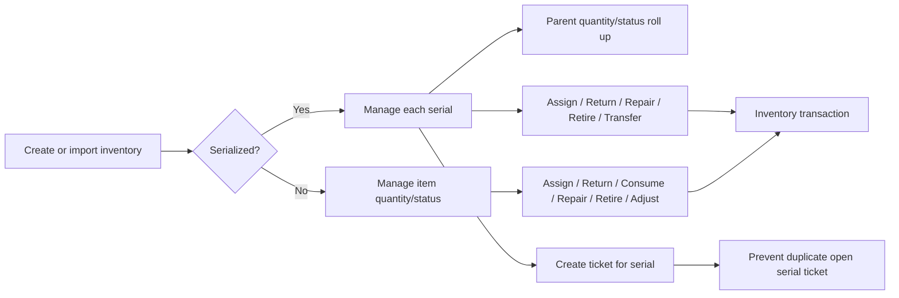

# Helpdesk Functions and Applied Business Logic

## 1. Document Purpose

This document describes the functions, workflows, authorization rules, data relationships, validations, side effects, and operational behavior currently implemented in the helpdesk application.

It is based on the application code and database structure as of June 22, 2026. It documents the system as implemented, including behavior that exists for backward compatibility with legacy helpdesk data.

The application is built with:

- PHP 8.4
- Laravel 12
- Filament 5
- Livewire 4
- Inertia 2
- Laravel Sanctum 4
- Laravel Octane 2
- Spatie Laravel Permission through Filament Shield
- MySQL
- Laravel queues

## 2. System Scope

The application provides the following major business capabilities:

1. Department-scoped helpdesk operations.
2. Ticket creation, classification, assignment, progression, and closure.
3. Client, administrator, and technical-support access control.
4. Inventory categories, assets, consumables, serial numbers, and locations.
5. Inventory assignment, return, consumption, transfer, repair, retirement, and stock adjustment.
6. Ticket creation directly from inventory items and serial numbers.
7. Inventory CSV import through queued jobs.
8. Database notifications for ticket activity and background imports.
9. Ticket analytics and PDF reporting.
10. User, department, position, role, and permission administration.
11. Microsoft Entra ID account provisioning and Microsoft 365 A3 license assignment.
12. Queue-job monitoring.

## 3. High-Level Architecture



## 4. Tenancy and Department Isolation

### 4.1 Department as the Filament tenant

The Filament panel uses `Department` as its tenant model.

Department-scoped panel URLs follow this structure:

```text
/department/{tenant}/...
```

Examples include:

```text
/department/{tenant}/tickets
/department/{tenant}/inventory-items
/department/{tenant}/users
/department/{tenant}/ticket-reports
```

### 4.2 Tenant access

A user can access a department tenant when either:

- The user has the `super_admin` role; or
- The department is attached to the user through the `department_user` pivot table with `is_deleted = 0`.

Super administrators receive every department where `department.is_deleted = 0`.

Other users receive only active departments attached through their tenant relationship.

### 4.3 Primary department versus tenant departments

The user record contains a primary `department_id`.

The many-to-many `departments()` relationship determines which Filament department workspaces the user may enter.

These concepts serve different purposes:

- `users.department_id` identifies the user's primary department.
- `department_user` controls access to one or more department tenants.
- Ticket creation normally assigns the ticket to the selected client's primary department.

### 4.4 Tenant-owned resources

The following resources declare a department ownership relationship:

- Tickets
- Inventory categories
- Inventory items
- Locations

Ticket queries also explicitly filter by the current tenant's `department_id`.

## 5. Authentication and Panel Access

### 5.1 Authentication

The application supports:

- Filament panel login.
- Laravel web authentication.
- Email verification for the Inertia dashboard.
- Password reset and password confirmation.
- Sanctum authentication for API ticket routes.

### 5.2 Panel access requirements

A user can access the Filament panel only when all of the following are true:

- `status === 1`
- `is_deleted === 0`
- The user has at least one of these roles:
  - `super_admin`
  - `admin`
  - `technical_support`
  - `client`
  - `panel_user`

An authenticated account without one of these roles cannot enter the panel.

### 5.3 Super-administrator override

The application defines a global authorization override for `super_admin`.

A super administrator is automatically allowed for ordinary permission checks, except these ticket workflow abilities:

- `startProgress`
- `markPending`
- `close`

Those three abilities deliberately remain subject to ticket assignment rules. A super administrator cannot progress or close a ticket merely because of the global role.

## 6. Roles and Permissions

### 6.1 Seeded roles

The application seeds these operational roles:

| Role | Intended scope |
|---|---|
| `super_admin` | Full administration and cross-department access |
| `admin` | Broad helpdesk, inventory, user, and reference-data administration |
| `technical_support` | Ticket handling and selected inventory operations |
| `client` | Own-ticket operations and selected inventory access |
| `panel_user` | Panel access without seeded resource permissions |

### 6.2 Resource permission pattern

Most resources use generated permissions with this pattern:

```text
view_{resource}
view_any_{resource}
create_{resource}
update_{resource}
restore_{resource}
restore_any_{resource}
replicate_{resource}
reorder_{resource}
delete_{resource}
delete_any_{resource}
force_delete_{resource}
force_delete_any_{resource}
```

Examples:

```text
view_ticket
view_any_ticket
create_ticket
update_ticket
delete_ticket
view_inventory::item
create_inventory::item
```

### 6.3 Custom inventory permissions

Inventory operations use additional business permissions:

```text
assign_inventory_item
adjust_stock_inventory_item
retire_inventory_item
```

### 6.4 Ticket role summary

| Capability | Super Admin | Admin | Technical Support | Client |
|---|---:|---:|---:|---:|
| View tickets permitted by policy | Yes | Yes | Yes | Own/created only |
| Create direct ticket | Yes | Yes | No seeded permission | Yes |
| Update ticket | Yes | Yes | Yes | Own/created only, restricted fields |
| Delete ticket | Yes | Yes | No seeded permission | No |
| Assign technical support | Yes | No | Yes | No |
| Start, pend, or close ticket | Only if assigned as technical support role | No | Yes, if assigned | No |
| Report across all departments | Yes | No | Yes | No |

The table reflects seeded permissions and explicit application logic. Permissions can be changed through role management.

## 7. Ticket Domain Model

### 7.1 Core ticket relationships

A ticket can belong to:

- A client user through `client_id`.
- A creator user through `created_by`.
- A department through `department_id`.
- An issue through `issue_id`.
- An inventory item through `inventory_item_id`.
- An inventory serial number through `inventory_item_serial_number_id`.
- Multiple technical-support users through `ticket_technical_support`.

### 7.2 Assignment relationship

Technical-support assignment is many-to-many:

```text
tickets
  |
  +-- ticket_technical_support
        |
        +-- users
```

The pivot stores timestamps so assignment relationship changes have creation and update times.

### 7.3 Ticket ownership visibility

The `visibleTo()` query scope applies this rule:

- A client sees tickets where the client is either:
  - `client_id`; or
  - `created_by`.
- Non-client users are not restricted by this scope.

The Filament ticket resource additionally restricts all records to the current department tenant.

### 7.4 Ticket priorities

The primary Filament ticket form supports:

- `low`
- `normal`
- `critical`

Direct panel ticket creation forces priority to `normal`.

The API validation also accepts `high` for compatibility:

- `low`
- `normal`
- `high`
- `critical`

### 7.5 Ticket statuses

The status enum defines:

| Stored value | Display label | UI color |
|---|---|---|
| `active` | Active | Success |
| `on progress` | On Progress | Warning |
| `pending` | Pending | Gray |
| `overdue` | Overdue | Danger |
| `closed` | Closed | Info |

### 7.6 Allowed status transitions



More explicitly:

| Current status | Allowed next statuses |
|---|---|
| Active | On Progress, Pending |
| On Progress | Pending, Closed, Overdue |
| Pending | On Progress, Closed, Overdue |
| Overdue | On Progress, Closed |
| Closed | None |

### 7.7 Status transition side effects

When a ticket enters `on progress`:

- `start_time` is set to the current time if it is empty.

When a ticket enters `closed`:

- `end_time` is set to the current time if it is empty.

After a successful transition:

- The client receives a database notification.
- The notification states the previous and new statuses.
- The notification includes a link to the ticket.

### 7.8 Closure requirements

A ticket cannot be closed unless both are present:

- `issue_id`
- `technical_support_remarks`

The close action therefore asks for:

- Issue category
- Issue
- Technical-support remarks

The selected category is a form helper. The stored ticket classification is the selected `issue_id`.

### 7.9 Workflow authorization

To start progress, mark pending, or close a ticket, the current user must:

1. Have the `technical_support` role.
2. Be assigned to that ticket through `ticket_technical_support`.
3. Have `update_ticket`.
4. Request a transition allowed by the status enum.

The UI also requires:

- The ticket is not already closed.
- The ticket has at least one technical-support assignment.
- The current user is one of the assigned technical-support users.

## 8. Ticket Creation

### 8.1 Direct panel ticket creation

Direct creation through the ticket resource applies these rules:

1. Inventory-specific fields are removed.
2. Technical-support assignment is removed.
3. Assignment and workflow timestamps are removed.
4. Technical-support remarks and confirmation fields are removed.
5. Client is forced to the authenticated user.
6. Priority is forced to `normal`.
7. Status is forced to `active`.
8. `created_by` is the authenticated user's ID.
9. `created_ticket` is the authenticated user's name.
10. Department is obtained from the client's primary `department_id`.

Direct ticket creation does not ask for category or issue classification. Classification is completed later during ticket handling and is mandatory before closure.

### 8.2 Department requirement

Ticket creation fails when the selected or authenticated client has no primary department.

The validation message explains that the account must be assigned to a department before creating a ticket.

### 8.3 Client field protection

When a client edits a ticket, the application strips internal fields from submitted data.

Clients cannot change:

- Client ownership
- Department ownership
- Category or issue classification
- Technical-support assignments
- Assignment status
- Assignment time
- Start time
- End time
- Status
- Rating
- Technical-support remarks
- Client confirmation

Clients can update client-facing content such as their comments, while subject and description are disabled in the Filament edit form.

### 8.4 Administrative client selection

The following roles can select a client in ticket workflows:

- `super_admin`
- `admin`
- `technical_support`

The selected client determines the ticket's department.

### 8.5 Programmatic ticket creation service

`TicketCreationService` provides transactional ticket creation for inventory-driven workflows.

It:

1. Removes non-persistent helper fields.
2. Validates the inventory item and serial-number relationship.
3. Removes unauthorized technical-support assignment data.
4. Resolves client and department ownership.
5. Applies client field restrictions.
6. Sets creator information.
7. Defaults status to Active.
8. Creates the ticket in a database transaction.
9. Synchronizes assignment state.
10. Notifies active helpdesk users.

### 8.6 Inventory serial validation

When a ticket references an inventory item:

- A serial number is required.
- The selected serial number must belong to the selected inventory item.
- The serial number must not already have an open ticket.

An open ticket is any ticket for that serial number whose status is not `closed`.

## 9. Ticket Assignment

### 9.1 Who can assign tickets

The assignment UI is available to:

- `super_admin`
- `technical_support`

Administrators are intentionally excluded from technical-support assignment management.

### 9.2 Which users can be assigned

Assignment options contain active, non-deleted users with either:

- `super_admin`; or
- `technical_support`.

Administrators and clients are excluded.

### 9.3 Self-assignment default

When a technical-support user opens the assign action, that user's own ID is selected by default.

A super administrator receives no default selection.

### 9.4 Assignment state synchronization

After assignment changes:

- `support_assignment_status` becomes `Assigned` when at least one technical-support user exists.
- It becomes `Not Yet Assigned` when none exist.
- `assigned_at` is set when the first assignment exists and no prior assignment time is present.
- `assigned_at` is cleared when all assignments are removed.

### 9.5 Assignment notifications

Newly assigned users receive a database notification containing:

- Ticket ID
- Ticket subject
- A link to view the ticket

The table-level assignment action notifies every user in the synchronized assignment list. The edit-page save workflow compares old and new assignment IDs and notifies only newly assigned users.

## 10. Ticket Lists, Tabs, Filters, and Search

### 10.1 Default query

The ticket list:

- Restricts records to the current department tenant.
- Applies client ownership visibility.
- Eager-loads client department, creator, issue, and assigned support users.
- Sorts newest tickets first.

### 10.2 Tabs

Available tabs include:

- All
- Open
- Pending
- Closed
- Assigned
- Unassigned
- My Assigned

`Open` includes:

- Active
- On Progress

`Assigned` and `Unassigned` are shown only to users allowed to manage technical-support assignments.

`My Assigned` is shown to admin or technical-support roles, although the assigned-ticket scope naturally returns records only when the current user exists in the assignment pivot.

### 10.3 Filters

The list supports:

- Multiple statuses
- Multiple priorities
- Assigned tickets
- Unassigned tickets
- Tickets assigned to the current technical-support user

### 10.4 Search

Ticket subject search also checks the related issue description.

The table shows the issue as a secondary description beneath the subject when available. It falls back to the legacy ticket `issue` text field when no normalized issue relationship is present.

## 11. Ticket Notifications

### 11.1 New ticket notification

When a ticket is created, active and non-deleted users with these roles are notified:

- `super_admin`
- `admin`
- `technical_support`

The notification is titled `New Unassigned Ticket` and links to the ticket edit page.

### 11.2 Assignment notification

Assigned support users receive `Ticket Assigned to You`.

### 11.3 Status notification

The ticket client receives `Ticket Status Updated` after a successful transition.

### 11.4 Delivery channel

Ticket notifications use the database channel.

The Filament panel:

- Enables database notifications.
- Polls for new notifications every 15 seconds.

### 11.5 Persistent unread alert

On authenticated Filament requests, middleware checks unread notifications.

If unread notifications exist:

- A persistent warning alert is shown.
- The alert includes the unread count.
- A link to the notification page is included when a tenant can be resolved.

The middleware stores an unread signature in the session:

```text
{unread count}|{latest unread notification ID}
```

The same alert is not repeatedly shown until the unread set changes.

## 12. Ticket API

### 12.1 Authentication

The ticket API is protected by `auth:sanctum`.

### 12.2 Create ticket endpoint

```http
POST /api/tickets
```

Required fields:

- `subject`
- `description`
- `priority`
- `client_id`
- `issue_id`

Optional fields:

- `asset_id`
- `asset_name`

The endpoint:

1. Validates input.
2. Loads the client.
3. Uses the client's primary department.
4. Sets status to Active.
5. Sets the client as creator.
6. Creates the ticket.
7. Notifies active super administrators, administrators, and technical-support users.
8. Returns HTTP 201.

### 12.3 Show ticket endpoint

```http
GET /api/tickets/{id}
```

It returns ticket identity, subject, description, status, priority, issue, department, asset details, and timestamps.

### 12.4 API implementation boundary

The API routes require an authenticated Sanctum user, but the controller currently does not apply the ticket policy or department/client visibility checks when showing a ticket by ID.

The API creation endpoint also accepts a caller-supplied `client_id`. This is current behavior and should be considered when issuing Sanctum tokens or exposing the API outside trusted integrations.

## 13. Inventory Domain

### 13.1 Inventory hierarchy



### 13.2 Inventory categories

Inventory categories:

- Belong to a department.
- Can have a parent category.
- Can have child categories.
- Can contain inventory items.
- Can define dynamic field definitions.
- Use an `is_deleted` flag instead of Laravel soft deletes.

Category types are stored as strings. CSV imports normalize type values to lowercase underscore-separated identifiers.

### 13.3 Inventory items

Inventory items contain:

- Category
- Optional asset tag
- Name and description
- Status
- Quantity and unit
- Assigned user
- Department
- Current ticket
- Metadata
- Purchase date
- Warranty expiry date
- Logical deletion flag

### 13.4 Inventory statuses

Supported inventory and serial statuses are:

- `available`
- `assigned`
- `in_repair`
- `retired`
- `lost`
- `disposed`

### 13.5 Serialized versus non-serialized items

The application treats items differently based on whether serial-number records exist.

For non-serialized items:

- Assignment, return, consumption, repair, retirement, and stock adjustment operate directly on the inventory item.

For serialized items:

- The item quantity is derived from serial-number count.
- The item status is derived from serial statuses.
- Page actions operate on a selected serial number.
- Table-level item actions are hidden where direct item mutation would conflict with serial-level state.

### 13.6 Serial-number rollup

Whenever a serial number is saved, moved to another item, or deleted, the related inventory item is synchronized.

The parent item's quantity becomes:

```text
count(serial numbers)
```

The parent item's status uses this precedence:

1. `assigned`
2. `in_repair`
3. `lost`
4. `disposed`
5. `retired`
6. `available`

If no serial numbers exist, the rollup status is `available`.

This means a single assigned serial causes the parent item to display `assigned`, even if other serials have different statuses.

### 13.7 Serial-number locations

Locations are applied to serial-number records.

The inventory ticket description uses the selected serial number's location. It does not use a general item location as a fallback.

## 14. Inventory Movement Logic

### 14.1 Transaction safety

Inventory movements run in database transactions.

The inventory row is loaded with `lockForUpdate()` before mutation. This reduces race conditions when multiple users attempt to change stock or assignment at the same time.

### 14.2 Inventory transaction audit record

Every movement creates an `inventory_transactions` record with:

- Inventory item
- Optional related ticket
- Actor
- Assigned user after the movement
- Transaction type
- Quantity
- Previous status
- Resulting status
- Notes
- Additional metadata

### 14.3 Assignment

Assignment:

- Uses quantity `1`.
- Changes status to `assigned`.
- Sets `assigned_to_user_id`.
- Optionally links a ticket.
- Records an `assigned` transaction.

### 14.4 Return

Return:

- Uses quantity `1`.
- Changes status to `available`.
- Clears `assigned_to_user_id`.
- Optionally links a ticket.
- Records a `returned` transaction.

### 14.5 Consumption

Consumption:

- Requires quantity of at least `1`.
- Rejects a quantity greater than available stock.
- Decrements item quantity.
- Does not force a new status.
- Records a `consumed` transaction.

### 14.6 Transfer

Transfer:

- Can change the item's department when `department_id` is supplied.
- Includes location and department information in transaction metadata.
- Does not currently update an item-level location column through the movement service.
- Records a `transferred` transaction.

For serialized items, page-level logic can update the selected serial number's location and records its ID in transaction metadata.

### 14.7 Repair

Repair:

- Changes status to `in_repair`.
- Preserves the assigned user.
- Optionally links a ticket.
- Records a `repaired` transaction.

### 14.8 Retirement

Retirement:

- Changes status to `retired`.
- Clears the assigned user.
- Records a `retired` transaction.

### 14.9 Stock adjustment

Stock adjustment:

- Rejects negative quantities.
- Replaces the current quantity with the new quantity.
- Records the absolute difference as transaction quantity.
- Stores `old_quantity` and `new_quantity` in metadata.
- Preserves the item status.

Stock adjustment is available only for items without serial numbers.

## 15. Inventory Ticket Creation

### 15.1 Purpose

Users can create tickets from inventory context so the ticket contains the affected asset and serial number.

### 15.2 Default serial selection

If an inventory item has exactly one serial number, that serial number can be selected automatically.

If it has zero or multiple serial numbers, no default serial is selected.

### 15.3 Default client

The default client is resolved in this order:

1. User assigned to the selected serial number.
2. User assigned to the inventory item.
3. Authenticated user.

### 15.4 Generated subject

Without a serial:

```text
Issue for {inventory item name}
```

With a serial:

```text
Issue for {inventory item name} ({serial number})
```

### 15.5 Generated description

The generated description can include:

- Item name
- Asset tag
- Serial number
- Serial-number location
- Assigned user
- An `Issue Details:` section

### 15.6 Duplicate open-ticket prevention

The create-ticket action is hidden when the serial already has an open ticket.

The service repeats this validation server-side to prevent bypassing the UI.

### 15.7 Created ticket data

Inventory-created tickets include:

- Inventory item ID
- Inventory serial-number ID
- Asset tag in `asset_id`
- Inventory name in `asset_name`
- Normal priority
- Client ownership
- Department ownership
- Creator identity

After creation, the user is redirected to the ticket view page.

## 16. Inventory CSV Import

### 16.1 Execution model

CSV imports are dispatched to a queued job.

The import job:

- Tries up to three times.
- Has a 120-second timeout.
- Uses backoff delays of 1, 5, and 10 seconds.
- Logs completion statistics.
- Logs row-level validation failures and continues importing other rows.
- Logs a terminal error through `failed()`.

### 16.2 Grouping repeated asset tags

Before import, rows with the same non-empty asset tag are grouped.

For grouped rows:

- Quantities are summed.
- Serial-number values are combined.

Rows without asset tags are treated as separate items.

### 16.3 Item matching

When `asset_tag` is present:

- The importer updates an existing item with that asset tag or creates a new one.
- A previously logically deleted item is reactivated.

When `asset_tag` is absent:

- A new item is always created.

### 16.4 Default status

Status is resolved as follows:

1. Use the supplied status when present.
2. Otherwise use `assigned` when an assigned user is supplied.
3. Otherwise use `available`.

### 16.5 Quantity

Imported quantity is the maximum of:

- Supplied quantity
- Number of imported serial numbers
- `1`

This prevents quantity from being lower than the number of serialized units.

### 16.6 Category resolution

If `inventory_category_id` identifies a category:

- The category is used.
- A category from another department is rejected.
- A deleted category is reactivated.
- A category without a department can be attached to the current tenant.

If the category ID is missing or unknown:

- `category_name` is required.
- The importer creates or reuses a category by department, name, type, and parent.

### 16.7 Parent categories

If `parent_category_name` is supplied:

- A parent category is created or reused.
- Parent type uses `parent_category_type` when present.
- Otherwise it uses the child category's normalized type.

### 16.8 Category type normalization

Category types are:

- Lowercased.
- Converted to underscore-separated values.
- Stripped of non-alphanumeric separators.

An empty normalized value is rejected.

The default type is `asset`.

### 16.9 Location parsing

Serial locations can be provided using:

- New lines
- Semicolons
- Pipes
- In some cases, commas

When the number of parsed locations matches the number of serial numbers, locations are assigned positionally.

Otherwise the entire location value is treated as one location and applied to every serial.

Missing locations are created within the current department.

### 16.10 Serial-number collision rules

If a serial number already belongs to another active inventory item:

- The serial is not moved.
- A warning is logged.
- Import of the current item continues.

If the existing parent inventory item is logically deleted:

- The serial may be moved to the imported item.

### 16.11 Import audit transaction

Every imported item receives a transaction:

- `created` for a new item.
- `adjusted` for an updated item.

The transaction records the actor, quantity, status, and import note.

## 17. Inventory Logical Deletion

Inventory items, categories, and locations use `is_deleted` flags.

Normal resource queries exclude logically deleted records.

Bulk inventory deletion updates `is_deleted = true`.

This is separate from Laravel's `SoftDeletes` trait and `deleted_at` column.

Azure account provisioning records use Laravel soft deletes instead.

## 18. Helpdesk Reference Data

### 18.1 Issue categories

Issue categories:

- Use the legacy `issue_category` table.
- Have a name and logical deletion flag.
- Own multiple issue-list entries.

### 18.2 Issue list

Issue-list entries:

- Use the legacy `issue_list` table.
- Belong to an issue category.
- Store the issue description.
- Use a logical deletion flag.

### 18.3 Departments

Departments:

- Use the legacy singular `department` table.
- Have a name.
- Can reference a unit-head user.
- Use a logical deletion flag.
- Own tickets, inventory categories, inventory items, and locations.

### 18.4 Positions

Positions:

- Use the legacy singular `position` table.
- Are available for user profile and administration.
- Use a logical deletion flag.

### 18.5 Roles

The database contains:

- A legacy singular `role` table referenced by `users.role_id`.
- Spatie Permission `roles`, `permissions`, and pivot tables.

Current authorization is based primarily on Spatie roles and permissions. Legacy fields remain for imported data and compatibility.

## 19. Ticket Reporting

### 19.1 Report filters

The ticket report supports:

- Multiple statuses
- Multiple priorities
- Assignment state
- Department
- Client
- Technical-support user
- Created-from date
- Created-until date

### 19.2 Visibility enforcement

Report queries apply the same client ownership visibility scope as ticket lists.

Department behavior:

- `super_admin` can report across all departments.
- `technical_support` can report across all departments.
- Other users are limited to their primary or attached department.
- A disallowed department filter is replaced with an allowed department.

### 19.3 Assignment filtering

The report can include:

- Only tickets with support assignments.
- Only tickets without support assignments.
- Tickets assigned to a specific support user.

### 19.4 Date normalization

`created_from` is normalized to the start of the selected day.

`created_until` is normalized to the end of the selected day.

### 19.5 PDF generation

The PDF is generated directly in PHP without an external PDF package.

The output:

- Uses PDF 1.4.
- Uses Courier.
- Uses landscape A4-like dimensions.
- Places up to 44 text lines on each page.
- Displays ID, creation time, status, priority, client, support users, and subject.
- Opens inline in the browser.

The file name follows:

```text
ticket-report-YYYY-MM-DD-HHMMSS.pdf
```

## 20. Dashboard Analytics

### 20.1 Department-aware analytics

`TicketStatsOverview` uses:

- Current Filament department tenant.
- Client ticket visibility rules.

It calculates:

- Open backlog
- Assignment coverage
- Unassigned open tickets
- Critical open tickets
- Tickets resolved today
- Tickets created this week
- Week-over-week creation change
- Aging backlog open for at least three days
- Average resolution time

### 20.2 Open status definition

Dashboard open tickets include:

- Active
- On Progress
- Pending
- Overdue

This differs from the ticket-list `Open` tab, which currently includes only Active and On Progress.

### 20.3 Assignment coverage

Assignment coverage is:

```text
assigned open tickets / all open tickets * 100
```

When there are no open tickets, the helper returns `0`.

### 20.4 Average resolution

Average resolution time uses closed tickets where both `start_time` and `end_time` are present.

MySQL calculates the average duration in minutes. The application converts it to hours with one decimal place.

### 20.5 Additional charts

The application contains charts for:

- Tickets by status
- Tickets by priority

These chart classes currently query the complete ticket table directly and do not apply the tenant or client visibility scope used by `TicketStatsOverview`.

## 21. Microsoft Entra ID and Microsoft 365 Provisioning

### 21.1 Access

Azure account functionality is available only to `super_admin`.

It is not scoped to the current department tenant.

### 21.2 Supported account types

| Account type | Assigned license |
|---|---|
| Student | `M365EDU_A3_STUUSEBNFT` |
| Faculty | `M365EDU_A3_FACULTY` |

### 21.3 Student user principal name

Student UPNs are generated from given name and surname:

1. Join the names.
2. Convert to lowercase.
3. Remove all non-alphanumeric characters.
4. Append `@spup.edu.ph`.

Example:

```text
Juan Dela Cruz -> juandelacruz@spup.edu.ph
```

Faculty UPNs can be entered manually.

### 21.4 Provisioning workflow



### 21.5 License availability

Before creating a user, the service:

- Loads subscribed SKUs.
- Selects the expected SKU for the account type.
- Requires available capacity where enabled seats exceed consumed seats.

If no seat is available, provisioning stops before user creation.

### 21.6 Temporary password

The service generates a 16-character password.

The Entra user is configured to change the password on next sign-in.

The local model stores the password using Laravel's encrypted cast.

After creation, credentials are placed in the session and shown in a one-time modal on the edit page.

### 21.7 Provisioning statuses

Common statuses include:

- `pending`
- `user_created`
- `provisioned`
- `failed`
- `password_reset`
- `imported`

### 21.8 Failure recording

Provisioning failures:

- Set local status to `failed`.
- Store the exception message in `last_error`.
- Show a danger notification.

If user creation succeeds but license assignment fails, the local record can remain in `user_created` or be changed to `failed` by the page-level error handler, while the Entra user may already exist.

### 21.9 Password reset

Password reset:

- Generates a new 16-character temporary password.
- Updates the Entra password profile.
- Requires a password change at next sign-in.
- Stores the encrypted password locally.
- Changes status to `password_reset`.
- Displays the credentials in a persistent notification.

### 21.10 Deletion

Deleting an Azure account:

1. Deletes the user from Microsoft Entra ID.
2. Treats an already-missing Entra user as a successful directory state.
3. Soft-deletes the local record only after directory deletion succeeds.

If directory deletion fails:

- The local record is retained.
- Status becomes `failed`.
- `last_error` is populated.

Bulk deletion applies the same rule to every selected record and reports deleted and failed totals.

### 21.11 Microsoft user import

Super administrators can queue an import from Microsoft Graph.

The user chooses which columns to import.

Only users with one of the supported A3 licenses are imported.

Users without supported licenses are counted as skipped.

The service:

- Reads Microsoft users in pages of up to 999.
- Follows `@odata.nextLink`.
- Detects repeated pagination links.
- Updates or creates local records by `azure_user_id`.
- Sets imported records to `imported` when status is selected.

### 21.12 Import job behavior

The Microsoft import job:

- Tries three times.
- Has a 3,600-second timeout.
- Fails on timeout.
- Uses backoff delays of 5, 30, and 120 seconds.
- Notifies the requesting user when it starts.
- Notifies the requesting user when it completes.
- Reports imported and skipped counts.
- Notifies the requesting user when it fails.

### 21.13 HTTP behavior

Microsoft Graph requests use:

- JSON requests and responses.
- OAuth client-credentials authentication.
- 20-second request timeout.
- 5-second connection timeout.
- Retry delays of 200, 500, and 1,000 milliseconds.

The service validates that Azure credentials are configured.

It also rejects a client secret that appears to be a UUID, because that usually indicates the Azure secret ID was supplied instead of the secret value.

## 22. Queue Monitoring

### 22.1 Queue-job model

The queue-job resource reads Laravel's `jobs` table.

It derives:

- Display name from the JSON job payload.
- Status as `processing` when `reserved_at` exists.
- Status as `queued` otherwise.
- Human-readable date objects from queue timestamps.

### 22.2 Access

Queue monitoring is intended for super administrators.

### 22.3 Background processes

Current queued workflows include:

- Inventory CSV import
- Microsoft user import

Ticket database notifications use Laravel notifications but are not declared with `ShouldQueue`, so they are stored synchronously through the database notification channel.

## 23. User and Profile Management

### 23.1 User data

User records contain:

- Name
- Username
- Email
- Password
- Address
- Contact
- Photo
- Primary department
- Position
- Legacy role
- Status
- Logical deletion flag

### 23.2 Password security

The user model uses Laravel's `hashed` password cast.

The profile workflows require the current password when changing a password.

### 23.3 Active selection rules

User selectors for assignments normally exclude:

- Inactive users where `status != 1`
- Logically deleted users where `is_deleted != 0`

Department and position selectors similarly exclude logically deleted reference records.

## 24. Data Integrity and Concurrency Rules

The following safeguards are implemented:

- Ticket status changes use a defined transition map.
- Ticket closure requires issue classification and support remarks.
- Status actions require assigned technical support.
- Inventory movement uses database transactions.
- Inventory movement locks the item row before mutation.
- Stock consumption cannot exceed quantity.
- Stock quantity cannot be adjusted below zero.
- Inventory tickets require a serial belonging to the selected item.
- A serial number cannot receive a second open ticket.
- CSV categories cannot cross department boundaries.
- Active serial numbers are not silently moved between inventory items.
- Azure local deletion occurs only after directory deletion succeeds.
- Microsoft license availability is checked before user creation.

## 25. Legacy Compatibility

The application includes both normalized relationships and legacy text or foreign-key fields.

Examples in `tickets` include:

- Normalized `department_id` and legacy `department`.
- Normalized `issue_id` and legacy `issue`.
- Assignment pivot table and legacy `technical_support` or `technical_support_id`.
- Normalized client relationship and legacy client text fields.

Current Filament workflows use normalized relationships where available.

Legacy fields remain because the system has migrated historical helpdesk data and still supports fallback display behavior.

## 26. Logical Deletion Strategies

The application uses two deletion strategies:

### 26.1 Boolean logical deletion

These records commonly use `is_deleted`:

- Users
- Departments
- Positions
- Legacy roles
- Issue categories
- Issue-list entries
- Inventory categories
- Inventory items
- Locations
- Department-user pivot memberships

### 26.2 Laravel soft deletes

Azure account provisioning uses:

```text
deleted_at
```

### 26.3 Physical deletion

Some Filament resources still expose standard delete actions based on policy and resource configuration. The exact deletion result depends on whether the model uses a logical flag, Laravel soft deletes, or neither.

## 27. Main Database Relationships

| Model | Important relationships |
|---|---|
| User | Primary department, tenant departments, position, legacy role, assigned tickets, assigned inventory, inventory transactions |
| Department | Unit head, users, tickets, categories, inventory items, locations |
| Ticket | Client, creator, department, issue, technical-support users, inventory item, serial number |
| IssueCategory | Issue-list entries |
| IssueList | Issue category |
| InventoryCategory | Department, parent, children, items, field definitions |
| InventoryItem | Category, assigned user, department, current ticket, transactions, tickets, serial numbers |
| InventoryItemSerialNumber | Inventory item, assigned user, location, tickets, open tickets |
| InventoryTransaction | Inventory item, ticket, actor, assigned user |
| Location | Department, active inventory serial numbers |
| AzureAccountProvisioning | Standalone Microsoft account provisioning record |

## 28. Key Application Services

| Class | Responsibility |
|---|---|
| `TicketCreationService` | Transactional programmatic ticket creation and inventory serial validation |
| `InventoryMovementService` | Locked inventory mutations and transaction recording |
| `InventoryTicketDefaults` | Default client, serial, subject, and description for inventory tickets |
| `InventoryItemCsvImporter` | Per-row inventory import and upsert rules |
| `ImportInventoryItemsFromCsv` | Queued grouping and processing of inventory CSV rows |
| `MicrosoftGraphService` | Entra user, license, password, deletion, and import operations |
| `ImportMicrosoftUsers` | Queued Microsoft user import and actor notifications |
| `TicketPdfReport` | Filter normalization, authorized ticket query, and PDF generation |

## 29. Important Implementation Notes

The following are notable characteristics of the current implementation:

1. Ticket list `Open` means Active and On Progress, while dashboard open backlog also includes Pending and Overdue.
2. The ticket API requires Sanctum authentication but does not currently authorize individual ticket access in the controller.
3. API ticket creation accepts a caller-supplied client ID.
4. The status and priority chart widgets query all tickets directly rather than using the current tenant and visibility scope.
5. The Filament priority form omits `high`, while the API and priority chart recognize it.
6. Direct panel ticket creation intentionally delays issue classification until handling or closure.
7. A super administrator can assign tickets but cannot progress or close them unless the account also satisfies the explicit assigned `technical_support` role check.
8. Some client inventory permissions are broad in the seeded role configuration, including update, assign, stock adjustment, and retirement.
9. Inventory transaction records are append-only by business intent, but the resource currently contains generated create/edit page classes.
10. Legacy and normalized data fields coexist and should be considered when changing queries or migrations.

## 30. Automated Test Coverage

The application has PHPUnit feature tests covering:

- Authentication and account workflows.
- Filament resource behavior.
- Tenant department relationships.
- Shield role and permission seeding.
- Panel-access restrictions.
- Ticket ownership permissions.
- Technical-support assignment permissions.
- Ticket status transitions.
- Ticket closure requirements.
- Ticket list and action visibility.
- Ticket assignment state and timestamps.
- Ticket PDF filtering and department restrictions.
- Inventory item relationships and logical deletion.
- Serial-number quantity and status synchronization.
- Inventory assignment, consumption, and stock adjustment.
- Inventory transaction relationships and metadata.
- Inventory ticket defaults.
- Inventory serial-ticket creation.
- Duplicate open-ticket prevention.
- CSV import categories, locations, quantities, grouping, and collision handling.
- Database notification alerts and mark-as-read behavior.
- Queue-job resource behavior.
- Azure account access restrictions.
- Microsoft user creation and license assignment.
- Password reset.
- Directory-first deletion.
- Microsoft user import and queued notifications.

## 31. Operational Summary

The core helpdesk business flow is:



The core inventory flow is:



Together, these rules make the application a department-aware helpdesk and asset-support platform in which ticket ownership, technical assignment, status progression, inventory state, audit transactions, and notifications are coordinated through explicit application services, model rules, policies, and Filament actions.
