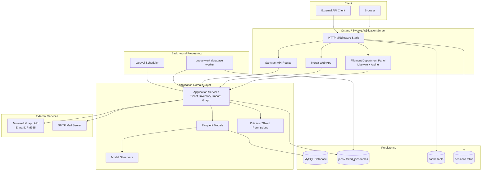
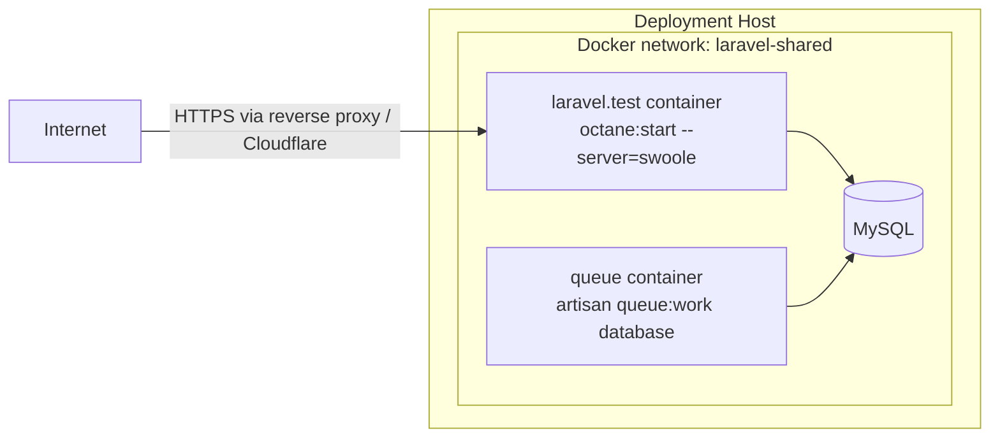
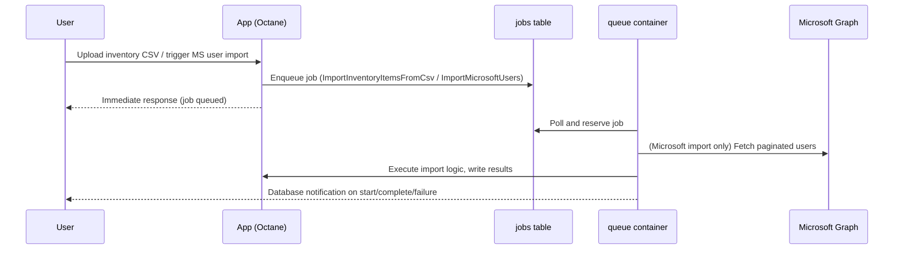

# Helpdesk System Design

## 1. Document Purpose

This document describes the technical system design of the helpdesk application: its architecture, runtime topology, technology stack, components, data flow, integration points, and operational characteristics.

For a complete description of business rules, workflows, and domain behavior, see `HELPDESK_FUNCTIONS_AND_BUSINESS_LOGIC.md`. This document focuses on **how the system is built and deployed**, not on the business logic it implements.

## 2. Technology Stack

| Layer | Technology |
|---|---|
| Language / runtime | PHP 8.4 |
| Web framework | Laravel 12 |
| Admin/operator UI | Filament 5 (Livewire 4, Alpine.js, Tailwind CSS) |
| Client-facing UI | Inertia.js 2 (Laravel Breeze scaffolding) |
| Authorization | Spatie Laravel Permission, via Filament Shield |
| API authentication | Laravel Sanctum 4 |
| Application server | Laravel Octane 2 (Swoole runtime) |
| Database | MySQL (SQLite for local/default env) |
| Queue backend | Database-backed queue (`QUEUE_CONNECTION=database`) |
| Cache / session store | Database (`CACHE_STORE`, `SESSION_DRIVER`) |
| External identity/mail integration | Microsoft Graph API (Entra ID, Microsoft 365) |
| Containerization | Docker / Laravel Sail |
| Testing | PHPUnit 12 |

## 3. High-Level Architecture



## 4. Deployment Topology

The application runs as three cooperating containers, orchestrated by `compose.yaml` and deployed via GitHub Actions to a self-hosted runner.



- **`laravel.test`**: runs the app under Octane/Swoole (`OCTANE_WORKERS`, `OCTANE_TASK_WORKERS`, `OCTANE_MAX_REQUESTS` configurable via env). Serves HTTP on port 80 (mapped via `APP_PORT`), plus a Vite dev port for local development.
- **`queue`**: dedicated worker container running `php artisan queue:work database --queue=default --sleep=3 --tries=3 --timeout=120`, restarted unless stopped.
- The two containers share the same application image and codebase (bind-mounted), differing only in the process they run.
- `ForceHttpsForCloudflare` middleware indicates the app sits behind Cloudflare/a reverse proxy that terminates TLS.

### 4.1 CI/CD

`.github/workflows/deploy.yml` triggers on push to `main` (or manual dispatch) and deploys over SSH to a self-hosted runner:

1. SSH into the target host.
2. `git fetch` / `checkout` / `pull --ff-only origin main`.
3. `docker compose up -d --build --remove-orphans`.
4. Install PHP deps (`composer install --no-dev --optimize-autoloader`) and JS deps (`npm ci && npm run build`) inside the running container.
5. `php artisan migrate --force`.
6. `php artisan optimize:clear`, then `config:cache`, `route:cache`, `view:cache`.

There is no separate staging environment or automated test gate in this workflow — deployment is a direct push-to-main pipeline. Test execution (`vendor/bin/sail artisan test`) is expected to happen before merge, not as part of this workflow.

## 5. Application Structure

Standard Laravel 12 streamlined layout, with Octane as the persistent process runtime (see Octane caveats in section 8).

```text
app/
  Console/Commands/        Scheduled/manual artisan commands (e.g. preventive-maintenance generation)
  Filament/
    Pages/                 Custom Filament pages
    Resources/             CRUD resources (Tickets, Inventory, Users, Azure accounts, ...)
    Widgets/                Dashboard widgets (stats, charts)
  Http/
    Controllers/            Auth controllers + Api\TicketController
    Middleware/              Auth, tenancy alerting, Cloudflare HTTPS, Inertia
    Models/                  (legacy path; primary models live in app/Models)
  Jobs/                     Queued jobs (CSV import, Microsoft user import)
  Models/                   Eloquent models
  Notifications/             Database-channel notifications
  Observers/                 Model observers (Ticket, JobOrder, InventoryItem)
  Policies/                   Authorization policies per resource
  Providers/Filament/         AdminPanelProvider (panel bootstrap, tenancy config)
  *.php (top-level app/)      Domain services (TicketCreationService, InventoryMovementService,
                               MicrosoftGraphService, PDF report generators, etc.)
bootstrap/app.php            Middleware, exception handling, routing registration (Laravel 12 style)
routes/
  web.php                    Breeze auth routes
  api.php                    Sanctum-protected ticket API
  console.php                 Scheduled commands, legacy-compat table bootstrap command
database/
  migrations/                 54 migrations (normalized schema + legacy compatibility tables)
  factories/                  Model factories for tests
```

Domain services are intentionally kept as plain top-level classes in `app/` rather than nested into subdirectories — this is an existing convention, not an omission.

## 6. Component Responsibilities

| Component | Responsibility |
|---|---|
| Filament `AdminPanelProvider` | Boots the panel, configures `Department` as the multi-tenant model, registers resources/widgets/pages |
| Filament Resources | CRUD + custom actions per domain entity (tickets, inventory, users, roles, Azure accounts, queue jobs, PMS) |
| `TicketCreationService` | Transactional ticket creation, inventory/serial validation, notification dispatch |
| `InventoryMovementService` | Row-locked, transactional inventory state changes (assign/return/consume/transfer/repair/retire/adjust) with audit trail |
| `InventoryItemCsvImporter` / `ImportInventoryItemsFromCsv` (Job) | Row-level import rules and queued batch processing for inventory CSV upload |
| `MicrosoftGraphService` | Entra ID user provisioning, license assignment/checks, password management, deletion, directory sync |
| `ImportMicrosoftUsers` (Job) | Queued paginated import of Microsoft 365 users |
| `TicketPdfReport` / `JobOrderPdfReport` / `PreventiveMaintenancePdfReport` | Filtered query + hand-rolled PDF generation (no external PDF library) |
| `PmsInspectionService` / `PreventiveMaintenanceGenerationService` | Preventive-maintenance scheduling and checklist generation |
| Observers (`TicketObserver`, `JobOrderObserver`, `InventoryItemObserver`) | Model-lifecycle side effects (status timestamps, notifications, rollups) |
| Middleware (`AlertUnreadDatabaseNotifications`, `ForceHttpsForCloudflare`, `HandleInertiaRequests`, `IsAdmin`) | Cross-cutting request concerns: notification alerting, TLS enforcement behind proxy, Inertia shared data, panel access gating |
| `Api\TicketController` | Sanctum-protected ticket creation/read endpoints for external integrations |

## 7. Data Layer

- **Primary datastore**: relational database (MySQL in deployment, SQLite by default locally), accessed exclusively through Eloquent.
- **Multi-tenancy**: implemented at the application/query layer (Filament tenant = `Department`), not via separate databases or schemas. Tenant isolation is enforced by scoped queries and policies, not database-level separation — see `HELPDESK_FUNCTIONS_AND_BUSINESS_LOGIC.md` §4 for the authorization rules this depends on.
- **Legacy + normalized coexistence**: the schema carries both normalized foreign keys (`department_id`, `issue_id`, pivot tables) and legacy text/ID columns (`department`, `issue`, `technical_support`) to preserve compatibility with migrated historical data. Queries and migrations must account for both.
- **Queue, cache, and session storage** all default to the same MySQL database (`jobs`, `cache`, `sessions` tables) rather than Redis — there is no separate cache/queue infrastructure to provision or fail over.
- **Logical vs. physical deletion**: most reference/domain tables use an `is_deleted` boolean flag; Azure account provisioning uses Laravel's native `SoftDeletes` (`deleted_at`). This is a deliberate inconsistency inherited from the legacy system, not a bug.

## 8. Runtime Model: Octane Considerations

The app runs under Laravel Octane (Swoole), which boots the application once per worker and reuses it across requests. This has concrete design implications enforced in the codebase:

- Long-lived singletons must not capture request/container/config state at construction time; use resolver closures instead.
- Static properties must not accumulate state across requests (no unbounded static caches).
- Database connections are disconnected between requests/workers (`DisconnectFromDatabases` listener) to avoid leaking stale connections across the persistent worker process.

This distinguishes the app from a traditional PHP-FPM request-per-process model — mistakes here manifest as cross-request data leakage or memory growth rather than being self-correcting on the next request.

## 9. Background Processing



Both queued job types are wired for retries with backoff (see `HELPDESK_FUNCTIONS_AND_BUSINESS_LOGIC.md` §16, §21 for retry counts/timeouts). Ticket notifications are **not** queued — they are dispatched synchronously via the database notification channel, so they do not depend on the queue worker being healthy.

The `queue` container is a single worker process (no horizontal worker scaling configured in `compose.yaml`); queue throughput is bounded by that one process today.

## 10. External Integrations

| Integration | Protocol | Purpose | Config source |
|---|---|---|---|
| Microsoft Graph API | HTTPS, OAuth2 client-credentials | Entra ID user provisioning, M365 A3 license assignment, directory sync/import | `config/services.php` (`azure.*`), env: `AZURE_TENANT_ID`, `AZURE_CLIENT_ID`, `AZURE_CLIENT_SECRET` |
| SMTP mail server | SMTP | Transactional email (password resets, verification) | `MAIL_HOST` / `MAIL_PORT` / `MAIL_FROM_*` |

No other third-party service integrations (payment, SMS, storage providers) are currently configured; `services.php` also has unused Postmark/Resend/SES/Slack scaffolding from the Laravel default skeleton.

## 11. Security Posture (Architectural)

- **AuthN**: session-based (Breeze) for web/panel; Sanctum tokens for the API.
- **AuthZ**: Spatie permissions generated and enforced through Filament Shield, layered under a `super_admin` override with explicit carve-outs (see business-logic doc §5.3).
- **Transport**: `ForceHttpsForCloudflare` middleware assumes TLS termination happens upstream (Cloudflare/reverse proxy) and enforces HTTPS at the app layer based on forwarded headers.
- **Secrets**: Azure client secret and provisioned account passwords are stored using Laravel's encrypted cast, not plaintext.
- **Known boundary gap**: the Sanctum ticket API does not currently apply the `TicketPolicy` or tenant/client visibility scoping in the controller — any authenticated Sanctum token can read arbitrary ticket IDs and create tickets for an arbitrary `client_id`. This is a documented current limitation (business-logic doc §12.4, §29) relevant to any decision to expose the API beyond trusted internal integrations.

## 12. Testing & Quality Gates

- PHPUnit 12 feature/unit tests cover panel behavior, policies, tenancy, ticket/inventory state machines, CSV import edge cases, and Azure provisioning flows (full inventory in business-logic doc §30).
- Laravel Pint enforces formatting; expected to run (`--dirty --format agent`) on any PHP change before it's considered complete.
- No test execution or linting step exists in the deploy workflow itself — quality gates are process-level (pre-merge), not pipeline-enforced.

## 13. Notable Architectural Trade-offs

1. **Shared MySQL for app data, queue, cache, and sessions** — simpler ops (one datastore to manage/back up), at the cost of queue/cache throughput being coupled to primary database load. No Redis in the stack.
2. **Single queue worker container** — no queue horizontal scaling; a stuck/slow job delays all other queued work.
3. **Push-to-deploy without a CI test gate** — deployment velocity is prioritized; correctness relies on discipline around running tests before merging to `main`.
4. **Hand-rolled PDF generation** (no library dependency) for reports — avoids an external dependency but means PDF layout logic is bespoke and manually maintained.
5. **Dual legacy/normalized schema** — enables a completed data migration from a legacy helpdesk system without a hard cutover, at the cost of ongoing query complexity.
6. **Application-layer multi-tenancy** (not database-per-tenant) — lower operational overhead, but tenant isolation is only as strong as the query-scoping and policy code, not enforced by infrastructure.
